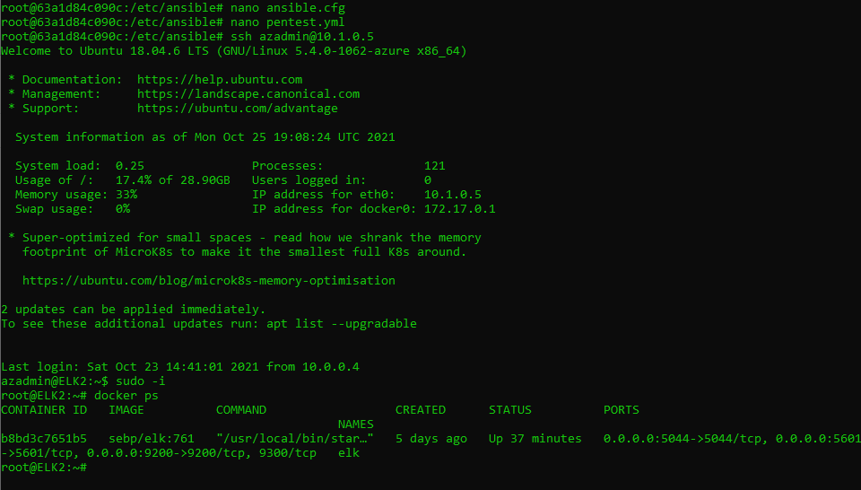

# Cybersecurity-Bootcamp
Cloud Security/Linux Systems/Network Diagrams 
## Automated ELK Stack Deployment

The files in this repository were used to configure the network depicted below.

These files have been tested and used to generate a live ELK deployment on Azure. They can be used to either recreate the entire deployment pictured above. Alternatively, select portions of the ansible file may be used to install only certain pieces of it, such as Filebeat.

(IntsallELKplaybook.txt)
---
- name: Configure Elk VM with Docker
  hosts: elk
  remote_user: azadmin
  become: true
  tasks:
    - name: Install docker.io
      apt:
        update_cache: yes
        force_apt_get: yes
        name: docker.io
        state: present

    - name: Install pip3
      apt:
        force_apt_get: yes
        name: python3-pip
        state: present

    - name: Install Docker python module
      pip:
        name: docker
        state: present

    - name: Use more memory
      sysctl:
        name: vm.max_map_count
        value: 262144
        state: present
        reload: yes

    - name: download and launch a docker elk container
      docker_container:
        name: elk
        image: sebp/elk:761
        state: started
        restart_policy: always

        published_ports:
          - "5601:5601"
          - "9200:9200"
          - "5044:5044"

    - name: Enable docker service
      systemd:
        name: docker
        enabled: yes

This document contains the following details:
- Description of the Topologu
- Access Policies
- ELK Configuration
  - Beats in Use
  - Machines Being Monitored
- How to Use the Ansible Build

### Description of the Topology

The main purpose of this network is to expose a load-balanced and monitored instance of DVWA, the D*mn Vulnerable Web Application.

Load balancing ensures that the application will be highly efficient and responsive to users, in addition to restricting unwanted access to the network.
- _TODO: What aspect of security do load balancers protect? What is the advantage of a jump box?
    a) Load balancers are great additions to networks beacuse they are able to mask different IP addresses and identities of servers behind the IP of the load balancer itself. 

Integrating an ELK server allows users to easily monitor the vulnerable VMs for changes to the file and system resources.
- _TODO: What does Filebeat watch for?_
    a) filebeat allows the logging of changes to a local system of files 
- _TODO: What does Metricbeat record?_
    a) metricbeat can allow an administrator to keep track of different CPU and RAM usage along with Network utilization. 

The configuration details of each machine may be found below.
_Note: Use the [Markdown Table Generator](http://www.tablesgenerator.com/markdown_tables) to add/remove values from the table_.

| Name      | Function      | IP Address   | Operating System |
|-----------|---------------|--------------|------------------|
| Jump Box  | Gateway       | 10.0.0.1     | Linux            |
| Web1      | WebServer     | 10.0.0.5     | Linux            |
| Web2      | WebServer     | 10.0.0.6     | Linux            |
| Elk2      | WebServer     | 10.1.0.5     | Linux            |
|Red-Team-LB| Load Balancer | 40.122.161.29| N/A              |

### Access Policies

The machines on the internal network are not exposed to the public Internet. 

Only the Jump Box machine can accept connections from the Internet. Access to this machine is only allowed from the following IP addresses:
- _TODO: Add whitelisted IP addresses_
    a) Web1     - 10.0.0.5
       Web2     - 10.0.0.6
       Elk2     - 10.1.0.5
       HostIPv4 - 73.59.187.34

Machines within the network can only be accessed by HostIPv4: 73.59.187.34.
- _TODO: Which machine did you allow to access your ELK VM? What was its IP address?_
    a) Web1 - 10.0.0.5

A summary of the access policies in place can be found in the table below.

| Name     | Publicly Accessible | Allowed IP Addresses |
|----------|---------------------|----------------------|
| Jump Box | Yes                 | 73.59.187.34         |
| Web1     | No                  | 10.0.0.5             |
| Web2     | No                  | 10.0.0.6             |
| Elk2     | SSH No/HTTP yes     | 10.1.0.5/73.59.187.34|   

### Elk Configuration

Ansible was used to automate configuration of the ELK machine. No configuration was performed manually, which is advantageous because...
- _TODO: What is the main advantage of automating configuration with Ansible?_
    a) the main advantage of automating the configuration with ansible is that if there was to be an emergency, the ansible-playbook could be used to re-deploy the same working enviornment. 

The playbook implements the following tasks:
- _TODO: In 3-5 bullets, explain the steps of the ELK installation play. E.g., install Docker; download image; etc._
-   a) Elk is installed in 5 steps starting with downloading and installing Docker
    b) the second step is to install python-pip3 and the pip docker module
    c) Next, increase the size of the vm.max_map_count variable to '262144' #sysctl -w vm.max_map_count=262144
    d) Install Elk inside the docker container
    E) make sure that both docker and ELK start with system bootup process 
- 

The following screenshot displays the result of running `docker ps` after successfully configuring the ELK instance.

### Target Machines & Beats
This ELK server is configured to monitor the following machines:
    a) Web1 10.0.0.5
    b) Web2 10.0.0.6
    
We have installed the following Beats on these machines:
    a) Web1: Filebeat, Metricbeat
    b) Web2: Filebeat, Metricbeat
    
These Beats allow us to collect the following information from each machine:
- _TODO: In 1-2 sentences, explain what kind of data each beat collects, and provide 1 example of what you expect to see. E.g., `Winlogbeat` collects Windows logs, which we use to track user logon events, etc._
Filebeat collects and monitors the system for local file system changes. Metricbeat on the other hand logs CPU and RAM utilization. 
### Using the Playbook
In order to use the playbook, you will need to have an Ansible control node already configured. Assuming you have such a control node provisioned: 

SSH into the control node and follow the steps below:
- Copy the filebeat-playbook.yml and metricbeat-playbook.yml file to /etc/ansbile/files.
- Update the /etc/ansible/hosts file to include...
- Run the playbook, and navigate to ____ to check that the installation worked as expected.

_TODO: Answer the following questions to fill in the blanks:_
- _Which file is the playbook? Where do you copy it?_
  a)filebeat-config.yml and it is copied to /etc/filebeat/filebeat.yml
- _Which file do you update to make Ansible run the playbook on a specific machine? How do I specify which machine to install the ELK server on versus which to install Filebeat on?_
  a) update the hosts file and use -c flag to specify which path to the config file
- _Which URL do you navigate to in order to check that the ELK server is running?
  a) http://10.1.0.5:5601/app/kibana 
_As a **Bonus**, provide the specific commands the user will need to run to download the playbook, update the files, etc._
1. sudo apt install ansible
2. sudo apt update
3. curl -L -O https://artifacts.elastic.co/downloads/beats/metricbeat/metricbeat-7.4.0-amd64.deb
4. dpkg -i metricbeat-7.4.0-amd64.deb
5. metricbeat modules enable docker
6. metricbeat setup
7. service metricbeat start
8. curl -L -O  https://artifacts.elastic.co/downloads/beats/filebeat/filebeat-7.4.0-amd64.deb
9. dpkg -i filebeat-7.4.0-amd64.deb
10. filebeat modules enable system
11. filebeat setup
12. service filebeat start

